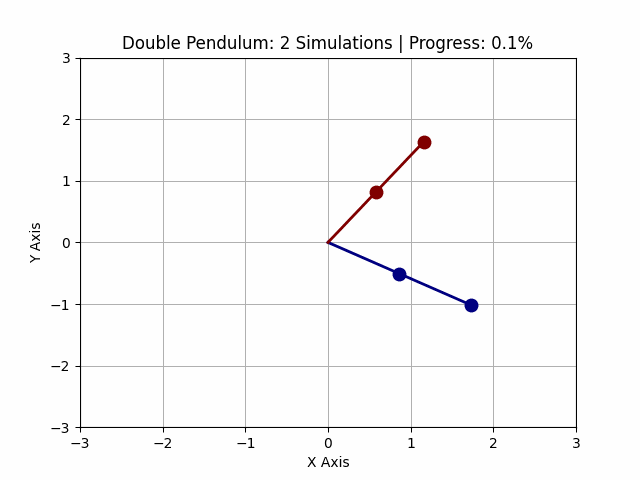
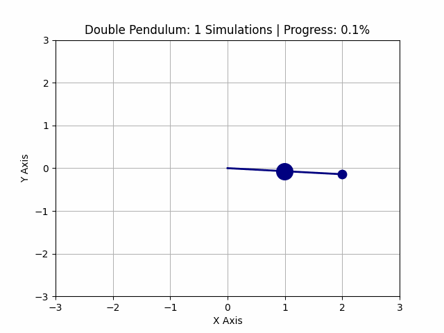
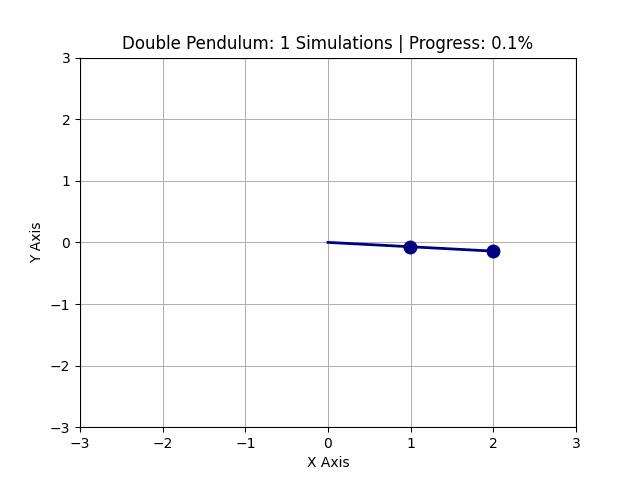

# Modeling-and-Simulating-Complex-Chaotic-Systems

## 1. Overview

This repository focuses on the numerical modeling and simulation of chaotic systems using Python. Chaotic systems are a subset of dynamical systems that exhibit extreme sensitivity to initial conditions, often leading to highly unpredictable behavior over time, despite being governed by deterministic equations. 

  
  
    

## 2. Chaos in Dynamical Systems

Chaos refers to the behavior of certain deterministic systems that, although governed by precise laws, are highly sensitive to initial conditions—a phenomenon often called the *butterfly effect*. In chaotic systems, small changes in the initial state can lead to drastically different outcomes, making long-term predictions extremely difficult, if not impossible.

  

## 3. Numerical Simulation of Chaotic Systems

Chaotic systems are typically modeled using systems of nonlinear differential equations. Since these equations are often impossible to solve analytically, **numerical methods** are employed. In this repository, we use Python and several powerful scientific libraries to tackle these problems:

- **`numpy`**: Provides efficient numerical operations, which are essential when dealing with large datasets or iterative methods.
- **`scipy`**: Particularly the `solve_ivp` function, is used to numerically solve initial value problems for differential equations.
- **`sympy`**: Used for symbolic mathematics, such as deriving equations of motion when modeling chaotic systems.
- **`matplotlib`**: Used for visualization, including both static plots and animations that help illustrate the complex behavior of chaotic systems.

**Numerical Solver Used**

The `solve_ivp` function from the `scipy.integrate` module is a versatile tool for solving system of ordinary differential equations (ODEs) numerically. The Runge-Kutta-Fehlberg (RK45) method is an adaptive step-size method used by default in `solve_ivp`. It uses two Runge-Kutta formulas of different orders (4th and 5th) to estimate the local error at each step. The method adapts the step size to keep this error within a user-defined tolerance, improving computational efficiency by taking larger steps where possible and smaller steps when the dynamics change rapidly.

## 4. Chaotic Systems Explored in This Repository

### 4.1. **Lorenz Attractor**
The Lorenz attractor is a famous example of chaos, originally derived from a simplified model of atmospheric convection. The system is governed by a set of nonlinear differential equations that exhibit chaotic behavior for certain parameter values. The Lorenz system illustrates how small differences in initial conditions can lead to vastly different outcomes.

  

#### Features
##### 1. Multiple Simulations

- Several simulations of the Lorenz attractor can be generate simultaneously by modifying the `n_simulations` parameter.

  
  
    2 Simulations (left) || 10 Simulations (right)

##### 2. Randomized or Perturbed Initial Conditions

- For randomized initial conditions (IC) `case = 1`, adjust the initial conditions block to generate random values within a range (e.g., np.random.rand for random values between [-10, 10]).
- For perturbed initial conditions `case = 2`, start with a base condition and apply small random changes by modifying the `perturbation` variable.

  
  
    100 Simulations with randomized IC (left) || 100 Simulations with small perturbation in the IC (right)

##### 3. Customizable Parameters

- The system parameters such as the Prandtl number (`sigma`), Rayleigh number (`rho`), and geometric factor (`beta`) can be adjusted to explore different dynamical behaviors of the Lorenz system.

  
  
    sigma = 10, beta = 8/3, rho = 13 (left) || sigma = 9.9, beta = 2.5, rho = 20 (right)

### 4.2. **Double Pendulum**
The double pendulum consists of two pendulums attached end-to-end. Despite its simple mechanical structure, it exhibits highly chaotic motion, especially for large initial displacements. This project numerically solves the equations of motion and generates animations to visualize the chaotic behavior.

#### Features
##### 1. Multiple Simulations

- Several simulations of the double pendulum can be generated simultaneously by modifying the `n_simulations` parameter.

  
  
    2 Simulations (left) || 10 Simulations (right)

##### 2. Randomized or Perturbed Initial Conditions

- For randomized initial conditions (IC) `case = 1`, adjust the initial angles to generate random values within a specified range (e.g., `initial_position = [np.pi / 4, np.pi / 4]`).
- For perturbed initial conditions, set `is_perturbed = True` and apply small random changes to the initial angles using a perturbation variable.

  
  
    10 Simulations with small perturbation 0.01 (left) || 50 Simulations with small perturbation 0.005 (right)

##### 3. Customizable Parameters

- The physical parameters such as masses of the pendulums (`m1`, `m2`), gravitational acceleration (`g`), and lengths of the pendulums can be adjusted to explore different motion dynamics of the double pendulum.

  
  
    m1 = 4, m2 = 2, g = 9.81 (left) || m1 = 2, m2 = 2, g = 1.62 (right)

### 4.3. **N-Body Problem**
The N-body problem involves predicting the motion of `n` gravitationally interacting bodies in space. Despite the simplicity of Newton’s law of gravitation, the system behaves chaotically for most initial conditions. The gravitational interactions between the bodies are modeled using nonlinear differential equations, which we solve numerically to visualize their complex orbital dynamics.

  

#### Features
##### 1. Multiple Simulations

- Several simulations of the N-body problem can be generated to visualize the interactions between different numbers of bodies by modifying the `n_planets` parameter.

  
  
    3 Planets (left) || 10 Planets (right)

## 5. Structure of the Repository

- **/Lorenz Attractor**: Code and animations for simulating the Lorenz attractor.
- **/Double Pendulum**: Code and animations for simulating the chaotic motion of a double pendulum.
- **/N_Body_Problem**: Code and animations for simulating the 3-body problem.
- **/README.md**: This documentation file.

Each folder contains:
- A mathematical background of the system, in the form of a notebook.
- Python scripts that implement the numerical solution (will generate a plot and/or animation showing the system's chaotic evolution).
- Visualization tools for plotting the system’s behavior.
